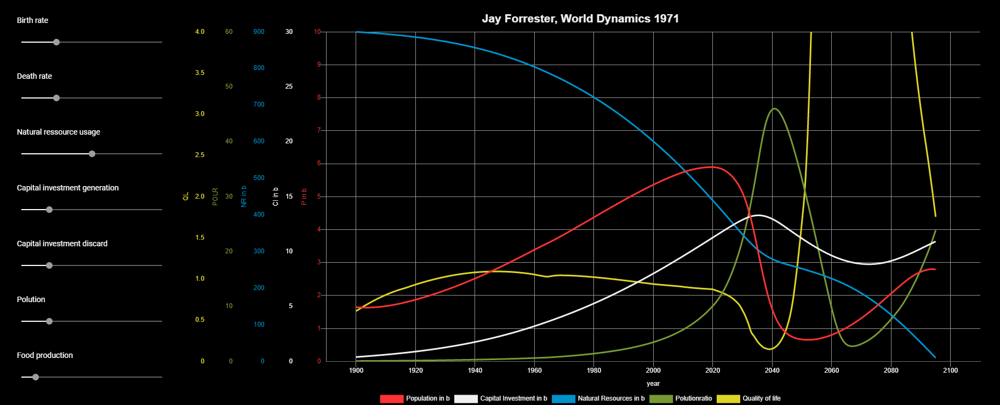

# Interactive Version of the World Dynamics model (1971) by Jay Wright Forrester

## About
The cybernetic world model of Jay Wright Forrester, the founder of system dynamics, published in 1971, attempts to predict the future growth of humanity. Population, natural resources, environmental pollution, agricultural and capital investment represent the five levels that interact through complex feedback loops in order to fully describe global human growth and quality of life. For example, the population is regulated by both birth and death rates, and both rates in turn interact directly as well as indirectly with all other system parameters, including themselves, through feedback loops that are interleaved with each other.
The model can be simulated completely by computer and shows that our exponential growth cannot be sustained in this way and that in all scenarios a collapse of humanity in the 21st century can only be prevented by immediate action (1971). All constants were chosen so that the simulation from 1900 to 1970 corresponds to reality. The model served as the basis for the more complex world model world3, which was the object of the book The Limits of Growth (Club of Rome) published one year later.
Just like the original from 1971, it is possible to run through potential scenarios and future predictions with the help of the modifiers. The modifiers only take effect from 1971 onwards; between 1900 and 1970, the progressions correspond to the history.

## Online Demo
See [interactive online demo](https://worlddynamics.web.app/).

